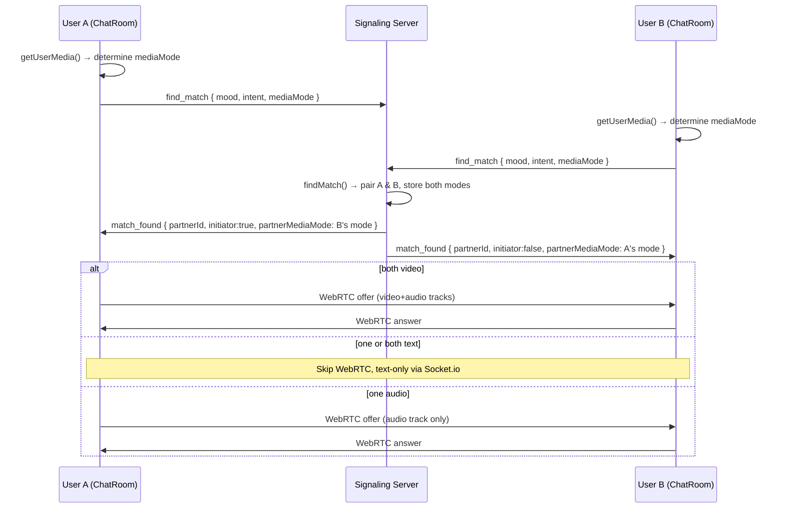

# Design Document — Media Mode Awareness

## Overview

This feature adds media mode detection, exchange, and UI feedback to Miloo's random video chat flow. The three possible modes — `video`, `audio`, and `text` — are determined client-side during media acquisition, sent to the signaling server as part of the `find_match` event, and relayed to the matched partner inside the `match_found` event. The ChatRoom UI uses the received `partnerMediaMode` to render appropriate placeholders and mode indicators, and adjusts WebRTC negotiation so that mismatched modes degrade cleanly.

No database changes are required. All state remains in-memory on the server.

---

## Architecture



---

## Components and Interfaces

### Server — `server/index.js`

**Changes:**

1. `find_match` handler: read `mediaMode` from the event payload and persist it in `userMeta`.
2. `createPair` / match dispatch: read each user's stored `mediaMode` and include it as `partnerMediaMode` in the `match_found` payload sent to each user.

No new Socket.io events are introduced. The change is purely additive to existing event payloads.

**Updated `find_match` handler (pseudocode):**
```
socket.on('find_match', ({ mood, intent, textOnly, mediaMode }) => {
  const safeMode = ['video', 'audio', 'text'].includes(mediaMode) ? mediaMode : 'text'
  setUserMeta(socket.id, { ...existingMeta, mediaMode: safeMode })
  // ... existing matching logic ...
  // on match:
  const partnerMode = getUserMeta(partnerId)?.mediaMode ?? 'text'
  const myMode      = getUserMeta(socket.id)?.mediaMode ?? 'text'
  io.to(socket.id).emit('match_found', { ..., partnerMediaMode: partnerMode })
  io.to(partnerId).emit('match_found', { ..., partnerMediaMode: myMode })
})
```

---

### Client — `client/src/pages/ChatRoom.jsx`

**New state:**
```js
const [myMediaMode, setMyMediaMode]           = useState('text')   // 'video' | 'audio' | 'text'
const [partnerMediaMode, setPartnerMediaMode] = useState(null)      // null until match_found
```

**Media acquisition (`initializeMediaAndSocket`):**

Replace the current hard-fail on `getUserMedia` error with a three-tier fallback:

```
try {
  stream = await getUserMedia({ video: true, audio: true })
  setMyMediaMode('video')
} catch {
  try {
    stream = await getUserMedia({ video: false, audio: true })
    setMyMediaMode('audio')
  } catch {
    stream = null
    setMyMediaMode('text')
  }
}
```

After mode is determined, emit `find_match` with `mediaMode` included.

**`match_found` handler:**
```js
socket.on('match_found', ({ partnerId, initiator, starter, partnerMediaMode }) => {
  setPartnerMediaMode(partnerMediaMode ?? 'text')
  // ... existing logic ...
})
```

**WebRTC negotiation (`startPC`):**

- If `myMediaMode === 'text'`: skip `createPC` / `startPC` entirely.
- If `myMediaMode === 'audio'`: add only audio tracks to the PeerConnection.
- If `myMediaMode === 'video'`: existing behavior (add all tracks).
- Wrap all WebRTC operations in try/catch; on error, log and fall back to text-only.

**New UI sub-components (inline in ChatRoom.jsx):**

| Component | Purpose |
|---|---|
| `PartnerPlaceholder` | Shown in the main video area when `partnerMediaMode !== 'video'` |
| `ModeIndicator` | Badge inside `PartnerPlaceholder` showing the mode label |
| `LocalPlaceholder` | Shown in the PiP corner when `myMediaMode !== 'video'` |

---

## Data Models

### `mediaMode` (string enum)

| Value | Meaning |
|---|---|
| `"video"` | Camera + mic both active |
| `"audio"` | Mic only, no camera |
| `"text"` | No camera, no mic |

### Server `userMeta` entry (extended)

```js
{
  ip: string,
  fingerprint: string,
  connectedAt: number,
  lastMood: string,
  lastIntent: string,
  textOnly: boolean,
  mediaMode: 'video' | 'audio' | 'text'   // NEW
}
```

### `match_found` event payload (extended)

```js
{
  partnerId: string,
  initiator: boolean,
  starter: string,
  partnerMediaMode: 'video' | 'audio' | 'text'   // NEW
}
```

### `find_match` event payload (extended)

```js
{
  mood: string,
  intent: string,
  textOnly: boolean,
  mediaMode: 'video' | 'audio' | 'text'   // NEW
}
```

---

## Correctness Properties

*A property is a characteristic or behavior that should hold true across all valid executions of a system — essentially, a formal statement about what the system should do. Properties serve as the bridge between human-readable specifications and machine-verifiable correctness guarantees.*

---

**Property 1: Media mode detection from stream tracks**

*For any* media stream, the mode detection function should return `"video"` if the stream has at least one video track and one audio track, `"audio"` if it has audio tracks but no video tracks, and `"text"` if it has no tracks or is null.

This consolidates criteria 1.2, 1.3, and 1.4 into a single property over all possible stream shapes. The mode detection logic is a pure function of the stream's track list, so it can be tested exhaustively with generated inputs.

**Validates: Requirements 1.2, 1.3, 1.4**

---

**Property 2: Partner mode is relayed symmetrically on match**

*For any* two users A and B with any media modes, when the server creates a pair, user A's `match_found` payload must contain B's media mode as `partnerMediaMode`, and user B's payload must contain A's media mode as `partnerMediaMode`.

This validates that the server's mode relay is symmetric and correct for all mode combinations (9 possible pairs: video/video, video/audio, video/text, audio/video, audio/audio, audio/text, text/video, text/audio, text/text).

**Validates: Requirements 2.1, 2.3**

---

**Property 3: Partner mode indicator renders correct text**

*For any* connected chat state where `partnerMediaMode` is `"text"`, the rendered ChatRoom output must contain the string "Text only". *For any* connected state where `partnerMediaMode` is `"audio"`, the output must contain "Voice only". *For any* connected state where `partnerMediaMode` is `"video"`, neither indicator string must appear.

**Validates: Requirements 3.1, 3.2, 3.3**

---

**Property 4: Non-video partner mode renders a placeholder**

*For any* connected chat state where `partnerMediaMode` is `"text"` or `"audio"`, the rendered ChatRoom must include a partner placeholder element and must not rely solely on the partner `<video>` element as the primary display.

**Validates: Requirements 3.4**

---

**Property 5: Local placeholder shown when no camera**

*For any* connected chat state where `myMediaMode` is `"audio"` or `"text"`, the rendered ChatRoom must include a local placeholder element containing a camera-off icon, and must not render the local `<video>` element as the primary local display.

This consolidates criteria 4.1 and 4.2.

**Validates: Requirements 4.1, 4.2**

---

**Property 6: PeerConnection tracks match local media mode**

*For any* local media stream and media mode, the tracks added to the PeerConnection must match the mode: all tracks for `"video"`, only audio tracks for `"audio"`, and no tracks (no PeerConnection created) for `"text"`.

**Validates: Requirements 5.1, 5.2, 5.3**

---

**Property 7: Text chat UI is always present when matched**

*For any* matched chat state with any combination of `myMediaMode` and `partnerMediaMode`, the rendered ChatRoom must include a text message input field and a send button.

**Validates: Requirements 6.1, 6.3, 6.4**

---

## Error Handling

| Scenario | Handling |
|---|---|
| `getUserMedia` throws `NotAllowedError` (permission denied) | Catch, fall back to audio-only attempt; if that also fails, set mode to `text` |
| `getUserMedia` throws `NotFoundError` (no device) | Catch, fall back to audio-only attempt; if that also fails, set mode to `text` |
| `getUserMedia` returns stream with no video tracks | Treat as `audio` mode |
| `getUserMedia` returns stream with no tracks | Treat as `text` mode |
| `RTCPeerConnection.createOffer()` throws | Catch, log, continue in text-only mode |
| `RTCPeerConnection.setLocalDescription()` throws | Catch, log, continue in text-only mode |
| `match_found` arrives without `partnerMediaMode` | Default to `"text"` (safe fallback) |
| `find_match` arrives at server without `mediaMode` | Default to `"text"` (safe fallback) |

---

## Testing Strategy

### Property-Based Testing

The property-based testing library for this feature is **[fast-check](https://github.com/dubzzz/fast-check)** (JavaScript/TypeScript). It integrates with Vitest and supports arbitrary generators for all the input shapes needed here.

Each property-based test must:
- Run a minimum of **100 iterations** (fast-check default is 100; set `{ numRuns: 100 }` explicitly).
- Be tagged with a comment in the format: `// Feature: media-mode-awareness, Property N: <property text>`
- Reference the requirements clause it validates.

**Properties to implement as PBTs:**

| Property | Test description |
|---|---|
| Property 1 | Generate random combinations of video/audio/no-track streams → assert correct mode |
| Property 2 | Generate random pairs of media modes → simulate server match → assert symmetric relay |
| Property 3 | Generate random app states with each partnerMediaMode value → render → assert indicator text |
| Property 4 | Generate random connected states with non-video partner → render → assert placeholder present |
| Property 5 | Generate random connected states with non-video local mode → render → assert local placeholder |
| Property 6 | Generate random streams and modes → assert correct tracks added to mock PeerConnection |
| Property 7 | Generate random matched states with any mode combination → render → assert input + send button present |

### Unit Tests

Unit tests cover:
- The `detectMediaMode(stream)` pure function with specific stream fixtures (null, empty, audio-only, video+audio).
- The server `find_match` handler with a specific `mediaMode` value to verify `userMeta` storage.
- The `match_found` client handler to verify `partnerMediaMode` state is set correctly.
- The `cam_error` fallback path is no longer reached for audio-capable devices (regression test).
