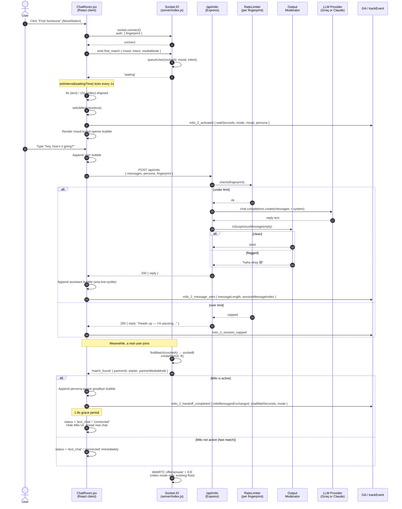
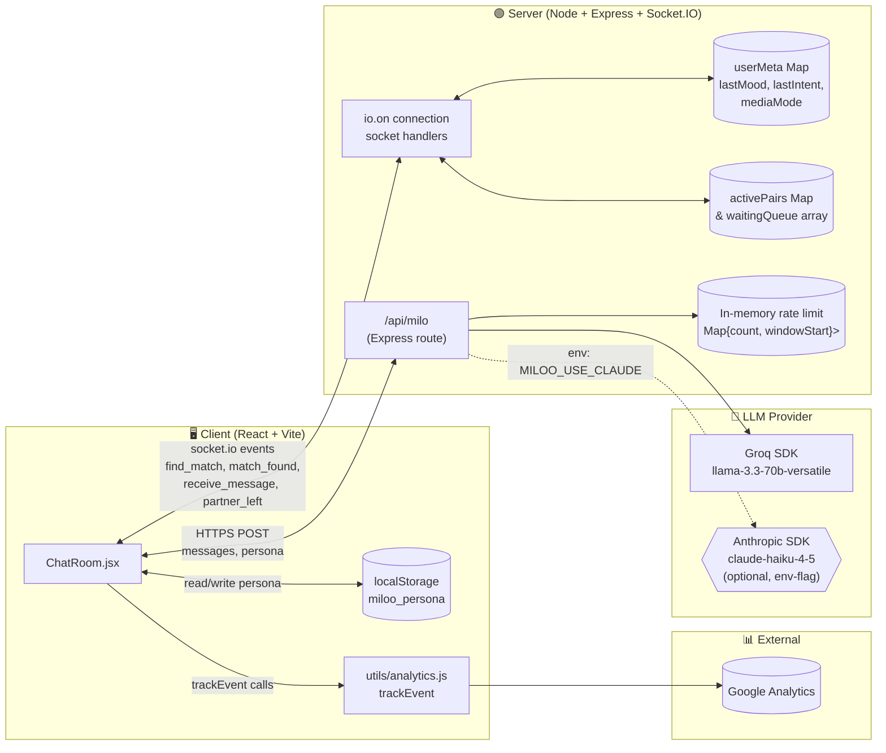
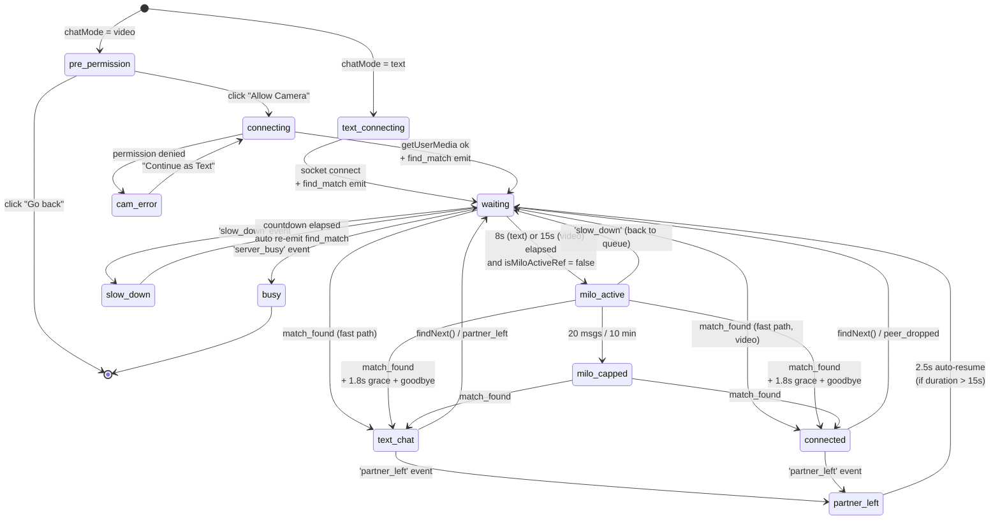
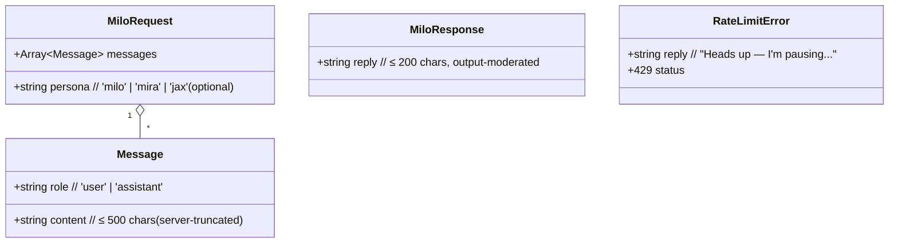

# Milo 2.0 — Data Flow Diagram

**Companion to:** `MILOO_MILO_2_0_DESIGN.md`
**Format:** Mermaid (renders in GitHub, VS Code preview, and most static-site generators)

---

## 1. End-to-end flow (sequence diagram)



---

## 2. Component / data-store view



---

## 3. State machine — `status` in ChatRoom.jsx (extended)



---

## 4. Data shape — `POST /api/milo` (request & response)



---

## 5. Failure & resilience paths

```mermaid
flowchart TD
    REQ[POST /api/milo] --> RL{per-fingerprint<br/>limit ok?}
    RL -- no --> CAP[200 reply: 'pausing...'<br/>+ GA: milo_2_session_capped]
    RL -- yes --> LLM[Call LLM]
    LLM -->|5xx / timeout| ERR[Client catch:<br/>show fallback bubble]
    ERR -->|1st / 2nd strike| KEEP[Keep Milo active]
    ERR -->|3rd strike in 60s| DEAD[Disable Milo for session<br/>toast: 'Milo is taking a break']
    LLM -->|200| MOD{isSuspiciousMessage<br/>on reply?}
    MOD -- yes --> SAFE[Replace with 'haha okay 😅']
    MOD -- no --> CHK{reply.length > 200?}
    CHK -- yes --> TRUNC[Truncate to 200 chars]
    CHK -- no --> OK[Return reply]
    SAFE --> OK
    TRUNC --> OK
    OK --> RESP[200 { reply }]
```

---

## 6. Telemetry map (where each event fires)

```mermaid
flowchart LR
    subgraph Client["ChatRoom.jsx"]
        ACT[milo_2_activated<br/>@ setIsMiloActive]
        SEND[milo_2_message_sent<br/>@ sendMiloMessage success]
        PICK[milo_2_persona_chosen<br/>@ persona card click]
        CAP[milo_2_session_capped<br/>@ capped reply received]
        HO[milo_2_handoff_completed<br/>@ match_found + isMiloActiveRef]
    end
    subgraph Server["server/index.js"]
        RL_T[milo_rate_limited<br/>@ /api/milo over limit]
    end
    GA[(Google Analytics)]
    ACT --> GA
    SEND --> GA
    PICK --> GA
    CAP --> GA
    HO --> GA
    RL_T -.optional.-> GA
```
